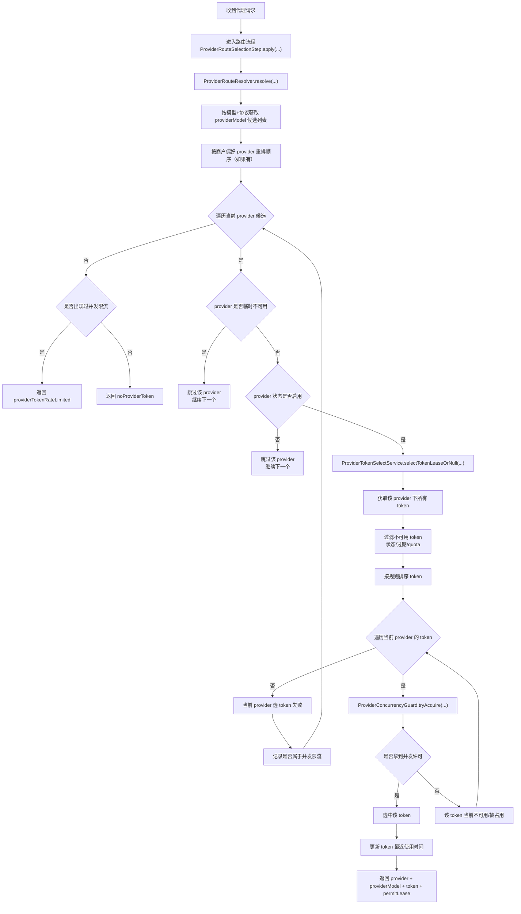

# API Provider / Token 路由与限流降级流程

本文整理 `api` 模块中 `provider` 选择、`token` 选择、并发限流、provider 降级的处理逻辑，便于排查和后续优化。

## 主流程图

## 关键结论

当前逻辑不是“某个 token 被占用，就立刻切下一个 provider”，而是：

1. 先拿 `provider` 候选列表。
2. 进入某一个 `provider`。
3. 把这个 `provider` 下所有可用 `token` 依次尝试一遍。
4. 只要有一个 `token` 拿到许可，就直接选中。
5. 如果这个 `provider` 下所有 `token` 都失败，才切下一个 `provider`。

所以更准确地说，策略是：

- `provider` 层面做降级
- `token` 层面做限流
- `provider` 内部先尽量消化
- 当前 `provider` 实在没有可用 `token`，再切到下一个 `provider`

## 代码映射

### 1. 路由入口

主入口在：

- `ProviderRouteSelectionStep.apply(...)`

对应文件：

- `xlinks-router-api/src/main/java/site/xlinks/ai/router/service/routing/ProviderRouteSelectionStep.java`

职责：

- 调用 `ProviderRouteResolver.resolve(...)`
- 将最终选中的 `provider / providerModel / providerToken / permitLease` 写入路由上下文

### 2. provider 级遍历

核心逻辑在：

- `ProviderRouteResolver.resolve(...)`

对应文件：

- `xlinks-router-api/src/main/java/site/xlinks/ai/router/service/routing/ProviderRouteResolver.java`

这里会做几件事：

1. 取候选 provider 列表  
   `routeCacheService.listProviderModelsByPriority(modelId, protocol)`

2. 按商户偏好 provider 重排  
   `prioritizeMerchantConfiguredProvider(...)`

3. 逐个遍历 provider

4. 如果 provider 临时不可用，则跳过

5. 如果 provider 状态不是启用，则跳过

6. 调用 `providerTokenSelectService.selectTokenLeaseOrNull(...)`，进入当前 provider 的 token 选择逻辑

7. 如果当前 provider 选不到 token，则继续尝试下一个 provider

### 3. token 级遍历

核心逻辑在：

- `ProviderTokenSelectService.selectTokenLeaseOrNull(...)`

对应文件：

- `xlinks-router-api/src/main/java/site/xlinks/ai/router/service/ProviderTokenSelectService.java`

处理顺序：

1. 先取当前 provider 下所有 token
2. 过滤不可用 token
3. 按排序规则排序
4. 逐个尝试 token
5. 某个 token 抢不到并发许可，则继续尝试下一个 token
6. 某个 token 成功拿到许可，则立即返回
7. 当前 provider 下全部 token 都失败，则返回“当前 provider 未命中”

### 4. token 可用性判断

逻辑在：

- `ProviderTokenSelectService.isAvailable(...)`

过滤条件包括：

- token 状态必须启用
- token 不能过期
- quota 不能耗尽

### 5. token 排序规则

逻辑在：

- `ProviderTokenSelectService.tokenComparator(...)`

当前排序规则：

1. 剩余额度多的优先
2. 最近最少使用的优先
3. 最后按 id 稳定排序

### 6. 并发限流

逻辑在：

- `ProviderConcurrencyGuard.tryAcquire(...)`

对应文件：

- `xlinks-router-api/src/main/java/site/xlinks/ai/router/service/ProviderConcurrencyGuard.java`

这里分两种情况：

- 没开并发限制：直接放行
- 开了并发限制：走 Redis `RPermitExpirableSemaphore` 抢 permit

如果抢不到 permit：

- 返回 `null`
- 上层继续尝试当前 provider 的下一个 token

## 降级和限流的区别

### provider 降级

由 provider 连续失败触发，被标记后，整个 provider 会被跳过。

逻辑在：

- `RouteCacheService.recordProviderFailure(...)`
- `RouteCacheService.isProviderTemporarilyUnavailable(...)`

对应文件：

- `xlinks-router-api/src/main/java/site/xlinks/ai/router/service/RouteCacheService.java`

### token 限流

由 token 并发许可抢不到触发，不会立刻判定 provider 不可用。

效果是：

- 当前 token 不可用
- 继续尝试同一个 provider 的下一个 token
- 只有当前 provider 下所有 token 都不行，才切到下一个 provider

## 一句话总结

这段代码的真实策略是：

- 先按优先级拿 `provider` 列表
- 对每个 `provider`，先把它自己的 `token` 池试完
- 当前 `provider` 下只要有一个 `token` 能拿到许可，就立即命中
- 当前 `provider` 所有 `token` 都不行，才切下一个 `provider`
- 连续失败的 `provider` 会被整体降级跳过
- 并发占满的 `token` 只是局部限流，不会直接让整个 `provider` 降级
