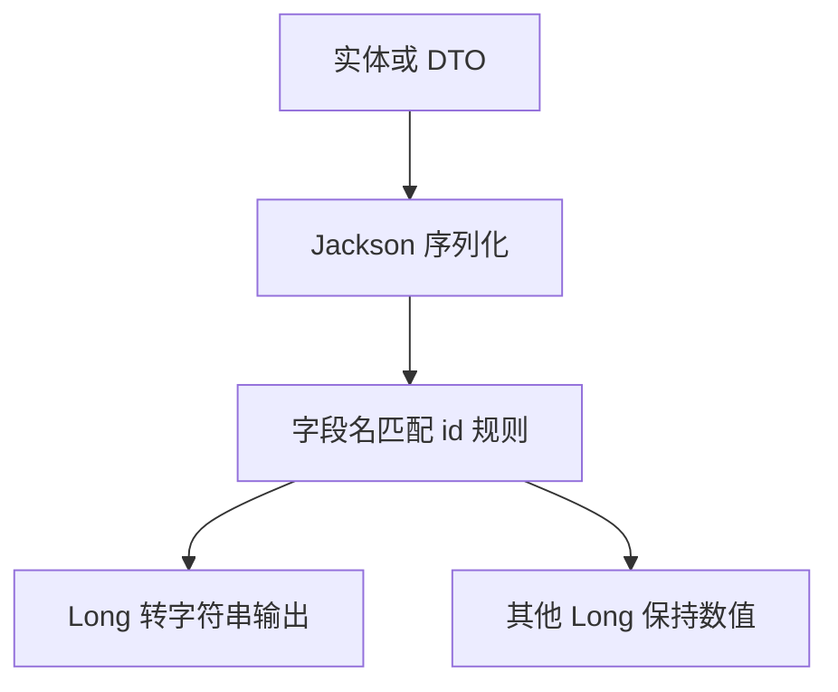

# 前端精度丢失问题处理方案（ID 字段序列化为字符串）

## 背景
- 数据库与 `curl` 输出正确，但前端 Vue + Element Plus 显示变成 `2038466977392558000`。
- 原因：前端 JS 使用 `number`（双精度浮点）表示超出 `2^53-1` 的 `Long`，导致精度丢失。

## 目标
- **仅对对外 API 响应中的 ID 字段**（`id`、`xxxId`、`accountId` 等）序列化为字符串。
- 其他 `Long` 字段仍保持数值类型，避免影响业务数值（配额、金额、时间戳等）。

## 方案概述（局部序列化）
- 通过 Jackson 的 `BeanSerializerModifier`，对字段名匹配 `id` 或以 `Id` 结尾的 **`Long/long` 字段**统一使用 `ToStringSerializer`。
- 作用范围：仅影响 Spring MVC 对外 JSON 响应的序列化，不影响数据库存储与业务逻辑。

### Mermaid（序列化流程）

## 实施步骤
1. **新增 Jackson 配置（建议放在公共模块）**
   - 在 `xlinks-router-common` 新增配置类，例如 `site.xlinks.ai.router.config.JacksonIdSerializerConfig`。
   - 注册 `Jackson2ObjectMapperBuilderCustomizer`，对字段名 `id` 或 `*Id` 的 `Long/long` 使用 `ToStringSerializer`。

2. **确保配置被所有应用加载**
   - Admin / API / Client 模块均依赖 common 模块，默认包扫描 `site.xlinks.ai.router` 即可生效。
   - 如某模块未扫描到公共配置，则在应用入口或配置类中 `@Import` 该配置。

3. **验证与回归**
   - 通过 `curl` 与前端请求比对输出 JSON：`id` 与 `xxxId` 应为字符串。
   - 确认配额、时间戳、金额等 `Long` 字段仍以数值返回。

## 影响范围评估
- **正向影响**：解决前端显示精度问题；无需前端改造。
- **兼容性**：前端 `id` 字段类型变为字符串，需要确保表格/筛选/排序逻辑按字符串或显式转换处理。
- **风险控制**：限定只处理 `id` 语义字段，避免影响非 ID 业务数值。

## 需要修改的文件（建议）
- `xlinks-router-common/src/main/java/site/xlinks/ai/router/config/JacksonIdSerializerConfig.java`（新增）
- 如需补充：对应模块的配置或入口类（仅在包扫描不包含公共配置时添加 `@Import`）

## 验收标准
- 前端页面显示的长整数 `id` 与数据库一致。
- 接口返回中 `id` 与 `xxxId` 为字符串，其他 `Long` 业务字段仍为数值。
